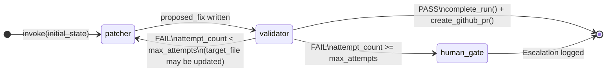
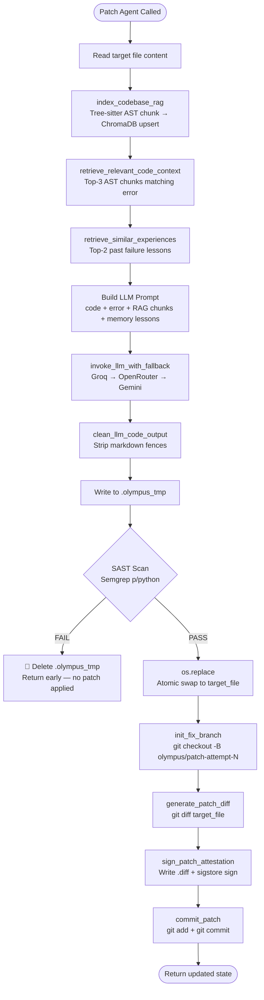
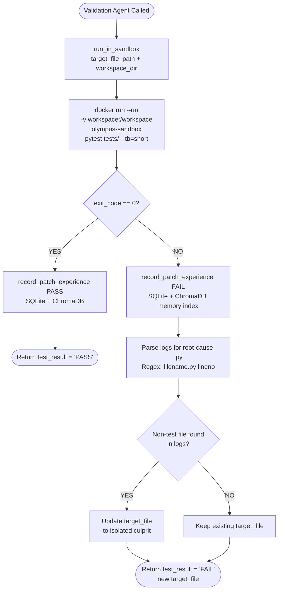
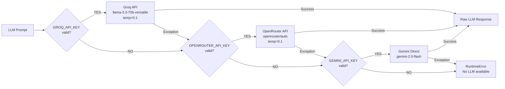

# Project Olympus — System Architecture

> **Autonomous SRE Engine v2.0** — Self-healing code repair via LangGraph agents, multi-LLM intelligence, RAG memory, sandboxed validation, and automated GitHub PR delivery.

---


---

## 1. Architectural Overview

Olympus follows a **layered agent pipeline** architecture with clear separation of concerns across five layers:

```
┌─────────────────────────────────────────────────────────────────┐
│                    LAYER 5: External Integrations               │
│          GitHub Repos · GitHub PR API · OIDC (Sigstore)         │
├─────────────────────────────────────────────────────────────────┤
│                    LAYER 4: Delivery Layer                      │
│         Git Manager · GitHub PR Engine · Sigstore Attestation   │
├─────────────────────────────────────────────────────────────────┤
│                    LAYER 3: Agent Engine Layer                  │
│       LangGraph StateGraph · Patch Agent · Validation Agent     │
│       Multi-LLM Fallback · Code RAG · Patch Memory · OTel       │
├─────────────────────────────────────────────────────────────────┤
│                    LAYER 2: Orchestration Layer                 │
│    FastAPI REST API · SSE Streaming · Background Task Runner    │
│    Workspace Manager · Fault Localizer · In-Memory Run Logger   │
├─────────────────────────────────────────────────────────────────┤
│                    LAYER 1: Presentation Layer                  │
│    Next.js 14 Frontend · Control Terminal · AgentGraph · Diff   │
└─────────────────────────────────────────────────────────────────┘
```

---

## 2. Full Component Architecture

```mermaid
graph LR
    subgraph TRIGGERS["🚀 Trigger Sources"]
        USER["👤 Developer\n(Browser UI)"]
        WEBHOOK["🔗 GitHub\nWebhook Event"]
    end

    subgraph FE["🖥️ Presentation Layer — Next.js 14 :3000"]
        CTRL["Control Terminal\nrepo_url · target_file · max_attempts"]
        AGRAPH["AgentGraph\n(step visualizer)"]
        DIFFV["DiffViewer\n(git diff renderer)"]
        LOGCON["Live Log Console\n(SSE EventSource)"]
    end

    subgraph ORCH["⚙️ Orchestration Layer — FastAPI :8000"]
        TR["/api/v1/trigger\nPOST"]
        SSE["/api/v1/stream/{run_id}\nGET · SSE"]
        WH["/api/v1/github-webhook\nPOST"]
        BG["BackgroundTasks\n(non-blocking runner)"]
        RUNLOG["In-Memory Run Logger\n(thread-local · mutex-locked)"]
        WM["Workspace Manager\n(git clone · path resolver)"]
        FL["Fault Localizer\n(pytest · traceback parse)"]
    end

    subgraph AGENT["🤖 Agent Engine — LangGraph StateGraph"]
        PA["Patch Agent\n─────────────\nRead file\nIndex RAG\nQuery RAG + Memory\nBuild LLM prompt\nInvoke LLM\nSAST gate\nApply patch\nGit branch + commit\nSign attestation"]
        VA["Validation Agent\n─────────────\nrun_in_sandbox()\nParse exit code\nUpdate target_file\nRecord to memory"]
        HG["Human Gate\n─────────────\nEscalation log\n(max attempts hit)"]
        ROUTER{"should_continue\n─────────────\nPASS → END\nFAIL+retry → patcher\nmax → human_gate"}
    end

    subgraph INTEL["🧠 Intelligence Layer"]
        LLM["Multi-LLM Fallback\n──────────────────\n① Groq llama-3.3-70b\n② OpenRouter auto\n③ Gemini 2.0-flash"]
        RAG["Code RAG\n──────────────────\nTree-sitter AST chunk\nChromaDB upsert\nSemantic retrieval"]
        MEM["Patch Memory\n──────────────────\nFail traceback index\nSemantic retrieval\nAnti-oscillation lessons"]
        OTEL["OpenTelemetry\n──────────────────\ntrace_span() wraps\npatch_agent + validator\nDuration tracking"]
    end

    subgraph SECURITY["🛡️ Security & Quality"]
        SAST["SAST Gate\n─────────\nSemgrep p/python\nScans .olympus_tmp\nHard block on fail\nAtomic file replace"]
        DOCK["Docker Sandbox\n─────────\nolympus-sandbox image\npython:3.11-slim + pytest\n-v mount workspace\npytest tests/ --tb=short"]
        ATT["Sigstore Attestation\n─────────\nWrite .diff artifact\nsigstore sign (OIDC)\nBundle → .sigstore.json"]
        GIT["Git Manager\n─────────\ncheckout -B branch\ngit diff target_file\ngit add + commit"]
    end

    subgraph PERSIST["💾 Persistence Layer"]
        SQLITE["SQLite DB\n─────────\nolympus_logs.db\npatch_logs table\n(id·ts·file·attempt\n status·diff·error_logs)"]
        CHROMA["ChromaDB\n─────────\ncodebase_chunks\npatch_experience\n(persistent local)"]
        ARTIF["Artifacts Store\n─────────\nbackend/artifacts/\npatch-attempt-N.diff\n*.sigstore.json"]
    end

    subgraph EXT["🔗 External Services"]
        GHAPI["GitHub API\n(PyGithub)\ncreate_pull()"]
        GHREPO["GitHub Repository\n(target codebase)"]
        LLMAPI["LLM APIs\n(Groq · OpenRouter\n· Google AI)"]
    end

    USER --> CTRL
    CTRL -->|"POST trigger"| TR
    WEBHOOK --> WH
    TR --> BG
    WH --> BG
    TR -->|"run_id"| CTRL
    CTRL -->|"open EventSource"| SSE
    SSE --> LOGCON
    LOGCON -->|"step detection regex"| AGRAPH

    BG --> WM
    WM -->|"git clone"| GHREPO
    WM --> FL
    FL -->|"pytest subprocess"| WM
    BG -->|"initial_state"| PA

    PA --> LLM
    PA --> RAG
    PA --> MEM
    PA --> SAST
    PA --> GIT
    PA --> ATT
    LLM --> LLMAPI

    SAST -->|"PASS: atomic swap"| PA
    SAST -->|"FAIL: discard"| PA

    PA --> VA
    VA --> DOCK
    DOCK -->|"exit_code + logs"| VA

    VA --> ROUTER
    ROUTER -->|"FAIL + retry"| PA
    ROUTER -->|"max attempts"| HG
    ROUTER -->|"PASS"| GHAPI

    PA --> RUNLOG
    VA --> RUNLOG
    RUNLOG --> SSE

    PA --> MEM
    VA --> MEM
    MEM --> SQLITE
    MEM --> CHROMA
    RAG --> CHROMA
    ATT --> ARTIF

    GHAPI -->|"create PR"| GHREPO
    ROUTER -->|"diff + result"| CTRL
    CTRL -->|"render diff"| DIFFV
```



---

## 3. Agent State Machine

The LangGraph `StateGraph` is the core of Olympus. It manages a **shared typed state** object passed between all nodes.



**State Schema:**
```python
class AgentState(TypedDict):
    bug_description: str    # trigger context
    proposed_fix:    str    # latest LLM-generated code
    test_result:     str    # "PASS" or "FAIL\n<logs>"
    attempt_count:   int    # current iteration (1-indexed)
    max_attempts:    int    # configurable cap (API param, 1-200)
    target_file:     str    # absolute path — dynamically updated
    workspace_dir:   str    # cloned repo root (empty = local)
    history:         List[str]  # per-attempt audit trail
    last_diff:       str    # git diff of most recent patch
```

---

## 4. Patch Agent Execution Flow



---

## 5. Validation Agent Execution Flow



---

## 6. Concurrency & Streaming Architecture

Olympus handles real-time streaming through a **thread-safe in-memory log bus**:

```
FastAPI Main Thread
      │
      ├── POST /trigger ──► create_run(run_id)
      │                     BackgroundTasks.add_task(run_olympus_pipeline)
      │                     return {run_id}  ← immediate response
      │
      └── GET /stream/{run_id} ── SSE generator (polls every 400ms)
                                  reads from _run_store[run_id]["logs"]

Background Thread (run_olympus_pipeline)
      │
      ├── set_run_context(run_id) ← binds run_id to thread-local
      │
      ├── [LangGraph nodes call push_log(msg)]
      │     └── _thread_local.run_id → appends to _run_store (mutex-locked)
      │
      └── complete_run(run_id, result, diff)
            └── sets done=True, result, diff in _run_store
```

**Key design**: `run_logger.py` is the **shared bus** — it avoids circular imports between `server.py` and `core_graph.py` since both import it independently.

---

## 7. RAG Architecture — Dual Vector Store Strategy

```
                    CHROMADB (Local Persistent)
                    ┌────────────────────────────────┐
                    │                                │
         Collection: codebase_chunks                │
         ┌──────────────────────────────┐           │
         │ Documents: AST code chunks   │           │
         │ Metadata: {file, symbol}     │           │
         │ IDs: filename::symbol_name   │           │
         │                              │           │
         │ Indexed by: Tree-sitter AST  │           │
         │ (function/class level, 35    │           │
         │  line windows per symbol)    │           │
         └──────────────────────────────┘           │
                    │                               │
                    │  Query: error_log text        │
                    │  Returns: top-3 code chunks   │
                    ▼                               │
             Patch Agent Prompt                     │
                                                    │
         Collection: patch_experience               │
         ┌──────────────────────────────┐           │
         │ Documents: error tracebacks  │           │
         │ Metadata: {file, attempt,    │           │
         │            status, diff[:300]}│           │
         │ IDs: file_attempt_hash       │           │
         │                              │           │
         │ Written on: every FAIL run   │           │
         └──────────────────────────────┘           │
                    │                               │
                    │  Query: current error_log     │
                    │  Returns: top-2 past failures │
                    ▼                               │
         Anti-oscillation lessons in prompt         │
                                                    │
         Also persisted to: SQLite patch_logs ──────┘
```

---

## 8. Multi-LLM Fallback Architecture



---

## 9. Security Architecture

```
Patch Generation Flow — Security Gates
══════════════════════════════════════════════════════════════

  LLM Output
      │
      ▼
  ┌─────────────────────────────────────────────────────┐
  │  GATE 1: Code Cleanliness                           │
  │  clean_llm_code_output() — strips markdown fences   │
  └───────────────────────────┬─────────────────────────┘
                              │
      Write to .olympus_tmp (never touch real file yet)
                              │
  ┌───────────────────────────▼─────────────────────────┐
  │  GATE 2: SAST — Semgrep (semgrep scan --config=p/python) │
  │                                                     │
  │  FAIL ──► delete .olympus_tmp, return state early   │
  │            (real file NEVER modified)               │
  │                                                     │
  │  PASS ──► os.replace(.olympus_tmp → target_file)   │
  │            (atomic filesystem swap)                 │
  └───────────────────────────┬─────────────────────────┘
                              │
  ┌───────────────────────────▼─────────────────────────┐
  │  GATE 3: Sandboxed Testing (Docker)                 │
  │  olympus-sandbox: python:3.11-slim + pytest         │
  │  Volume-mounted workspace, isolated /tmp cache      │
  │                                                     │
  │  FAIL ──► record failure, retry patch loop          │
  │  PASS ──► proceed to PR creation                    │
  └───────────────────────────┬─────────────────────────┘
                              │
  ┌───────────────────────────▼─────────────────────────┐
  │  GATE 4: Cryptographic Attestation (Sigstore)       │
  │  Saves .diff artifact                               │
  │  sigstore sign --oauth-identity-token offline       │
  │  Generates .sigstore.json bundle (CI: OIDC ambient) │
  └─────────────────────────────────────────────────────┘
```

---

## 10. Deployment Topology

```
Developer Machine / CI Server
┌────────────────────────────────────────────────────────────────┐
│                                                                │
│  ┌──────────────────────┐   ┌────────────────────────────┐   │
│  │ Next.js Dev Server   │   │ FastAPI + Uvicorn           │   │
│  │ npm run dev          │   │ python src/server.py        │   │
│  │ localhost:3000       │   │ localhost:8000              │   │
│  └──────────┬───────────┘   └──────────────┬─────────────┘   │
│             │ HTTP/SSE (CORS enabled)       │                  │
│             └───────────────────────────────┘                  │
│                                                                │
│  ┌─────────────────────────────────────────────────────────┐  │
│  │ Docker Engine                                           │  │
│  │  ┌──────────────────────────────────────┐              │  │
│  │  │ olympus-sandbox container            │              │  │
│  │  │ FROM python:3.11-slim                │              │  │
│  │  │ RUN pip install pytest               │              │  │
│  │  │ WORKDIR /workspace                   │              │  │
│  │  │ -v <target_dir>:/workspace           │              │  │
│  │  │ CMD: pytest tests/ --tb=short        │              │  │
│  │  └──────────────────────────────────────┘              │  │
│  └─────────────────────────────────────────────────────────┘  │
│                                                                │
│  ┌────────────────────┐  ┌─────────────────┐                  │
│  │ SQLite             │  │ ChromaDB         │                  │
│  │ database/data/     │  │ rag/data/        │                  │
│  │ olympus_logs.db    │  │ vector_db/       │                  │
│  └────────────────────┘  └─────────────────┘                  │
│                                                                │
│  Workspaces: backend/workspaces/<repo-name>/                   │
│  Artifacts:  backend/artifacts/*.diff + *.sigstore.json        │
└────────────────────────────────────────────────────────────────┘

        │                              │
        ▼                              ▼
  GitHub API                     LLM APIs
  (PyGithub)                  (Groq · OpenRouter · Gemini)
  create PR                    REST inference calls
```

---

## 11. Directory Structure Architecture

```
Olympus/
└── olympus-agent/
    ├── .env                         ← API keys (GROQ, OPENROUTER, GEMINI, GITHUB_TOKEN)
    ├── olympus.db                   ← Legacy SQLite (top-level)
    │
    ├── frontend/                    ← Next.js 14 + TypeScript + TailwindCSS v4
    │   ├── app/
    │   │   ├── layout.tsx           ← Root layout
    │   │   └── page.tsx             ← Main page (SSE client, state, trigger)
    │   └── components/
    │       ├── graph-flow/AgentGraph   ← Pipeline step visualizer
    │       ├── diff-viewer/DiffViewer  ← Git diff renderer
    │       └── telemetry/              ← OTel metrics panel
    │
    └── backend/
        ├── Dockerfile               ← olympus-sandbox image definition
        ├── artifacts/               ← Signed .diff files + .sigstore.json bundles
        ├── workspaces/              ← Cloned external repos (runtime)
        ├── target_app/              ← Default local test target
        │
        ├── config/
        │   └── settings.py          ← Env config loader
        │
        ├── database/
        │   ├── db.py                ← SQLite init + log_patch_run()
        │   └── data/olympus_logs.db ← Persistent relational store
        │
        ├── rag/
        │   ├── code_rag.py          ← Tree-sitter chunker + ChromaDB code index
        │   ├── patch_memory.py      ← Failure experience store + retrieval
        │   └── data/vector_db/      ← ChromaDB persistent collections
        │
        └── src/
            ├── server.py            ← FastAPI app, endpoints, pipeline orchestrator
            ├── agents/
            │   └── core_graph.py    ← LangGraph StateGraph (patch+validate+gate)
            └── utils/
                ├── attestation.py   ← Sigstore diff signing
                ├── code_graph.py    ← Repository structure analysis
                ├── git_manager.py   ← Branch, diff, commit ops
                ├── github_pr.py     ← PyGithub PR creation
                ├── github_webhook.py← Webhook payload helpers
                ├── repo_mapper.py   ← Tree-sitter AST repo map builder
                ├── run_logger.py    ← Thread-safe in-memory SSE log bus
                ├── sandbox.py       ← Docker subprocess executor
                ├── sast_scanner.py  ← Semgrep wrapper
                └── telemetry.py     ← OpenTelemetry trace_span() context mgr
```

---

## 12. Key Architectural Decisions

| Decision | Choice | Rationale |
|---|---|---|
| **Agent framework** | LangGraph `StateGraph` | Explicit state transitions, conditional routing, no black-box chains |
| **LLM strategy** | Multi-tier fallback (3 providers) | Resilience against rate limits; no single point of failure |
| **Code understanding** | Tree-sitter AST chunking | Token-efficient, symbol-aware indexing vs. naive line-splitting |
| **Vector store** | ChromaDB local persistent | Zero-infra, embedded, survives restarts |
| **Relational store** | SQLite | Lightweight audit log; no server to manage |
| **Security gate position** | Before file write (temp file) | Bad patches never touch production code |
| **Test isolation** | Docker container | Prevents host contamination; clean per-run state |
| **Streaming** | SSE (Server-Sent Events) | One-directional push, browser-native, no WebSocket overhead |
| **Thread communication** | Thread-local + mutex log bus | Avoids circular imports between server.py and core_graph.py |
| **Fault localization** | pytest subprocess + traceback regex | Autonomous; no config needed for new repos |
| **Anti-oscillation** | Patch Memory RAG lessons | LLM "remembers" what failed and avoids repeating it |
| **Code signing** | Sigstore (keyless OIDC) | Cryptographic provenance without managing private keys |
