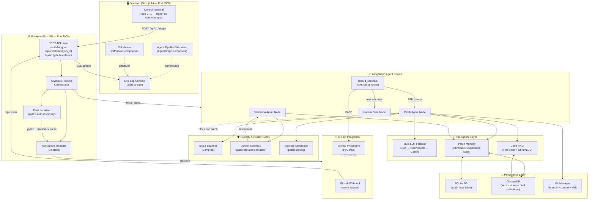
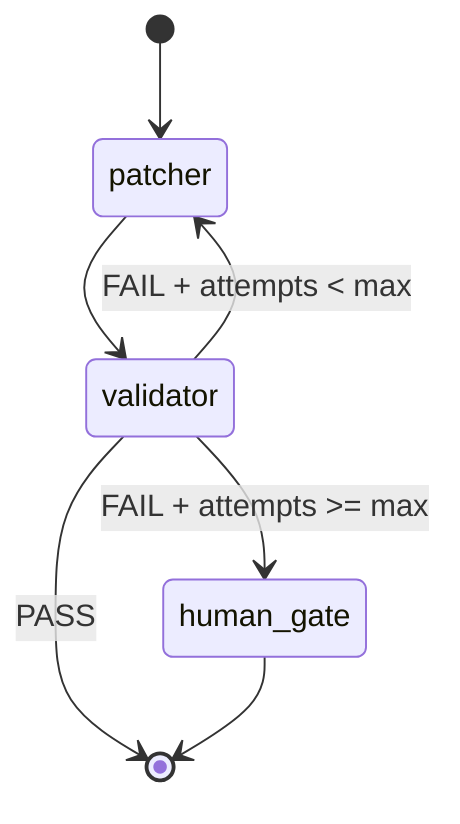
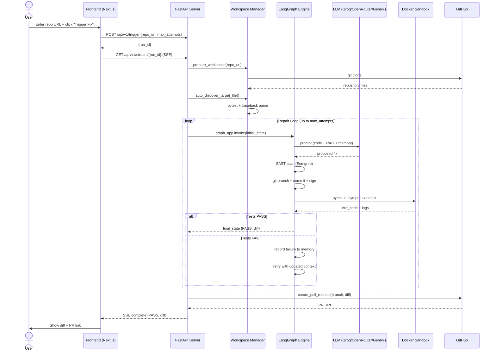

# Project Olympus — System Design

> **Autonomous SRE Engine** that clones GitHub repositories, localizes faults, generates verified patches via LLM, validates them in a Docker sandbox, and automatically opens a Pull Request.

---

## 1. High-Level Architecture



---

## 2. Component Breakdown

### 2.1 Frontend — Next.js 14

| Component | File | Responsibility |
|---|---|---|
| Main Page | [page.tsx](file:///c:/Users/Aviral/Desktop/Olympus/olympus-agent/frontend/app/page.tsx) | Control terminal, state management, SSE client |
| AgentGraph | `components/graph-flow/AgentGraph` | Visualizes 5-step pipeline live |
| DiffViewer | `components/diff-viewer/DiffViewer` | Renders the final git diff |
| TelemetryPanel | `components/telemetry/` | Runtime metrics display |

**Key frontend flows:**
- User submits repo URL → `POST /api/v1/trigger` → receives `run_id`
- Opens `EventSource` to `/api/v1/stream/{run_id}` for live SSE logs
- Log messages are parsed with regex to update `currentStep` (drives the graph animator)
- On `complete` event: receives `result` and `diff`, renders PR link

---

### 2.2 Backend — FastAPI

| Endpoint | Method | Purpose |
|---|---|---|
| `/health` | GET | Health probe |
| `/api/v1/trigger` | POST | Launch repair pipeline (returns `run_id`) |
| `/api/v1/stream/{run_id}` | GET | SSE log streaming (0.4s polling) |
| `/api/v1/github-webhook` | POST | GitHub Webhook event ingestion |

**Trigger flow:**
1. `create_run(run_id)` — reserve log store slot
2. `BackgroundTasks.add_task(run_olympus_pipeline, ...)` — non-blocking execution
3. Return `run_id` immediately so frontend can attach SSE

---

### 2.3 Workspace Manager & Fault Localizer

```
repo_url provided?
       │
       ▼
   Git Clone (workspaces/<repo>/)
       │
 target_file given? ──YES──► resolve absolute path
       │
       NO
       ▼
   Auto Fault Localization
       ├─ Run pytest subprocess (30s timeout)
       ├─ Parse tracebacks for .py file paths
       ├─ Prioritize non-test files
       └─ Fallback: walk repo tree for first .py source
```

---

### 2.4 LangGraph Agent Engine

The core repair loop is a **compiled StateGraph** with three nodes:



**Agent State Schema:**
```python
class AgentState(TypedDict):
    bug_description: str
    proposed_fix: str
    test_result: str
    attempt_count: int
    max_attempts: int       # configurable from API (1-200)
    target_file: str        # resolved absolute path
    workspace_dir: str      # cloned repo root
    history: List[str]      # audit trail per attempt
    last_diff: str          # git diff of applied patch
```

---

### 2.5 Patch Agent (`patch_agent` node)

Per-attempt execution pipeline:

```
1. Read target file content
2. index_codebase_rag(target_dir)       → Tree-sitter AST chunking → ChromaDB upsert
3. retrieve_relevant_code_context()     → semantic search over codebase chunks
4. retrieve_similar_experiences()       → semantic search over past failed patches
5. Build prompt (code + error + RAG + memory)
6. invoke_llm_with_fallback()           → Groq → OpenRouter → Gemini
7. Write proposed fix to temp file (.olympus_tmp)
8. run_sast_scan() on temp file         → Semgrep --config=p/python
   └─ FAIL: discard patch, return early
   └─ PASS: atomic os.replace() → target file
9. init_fix_branch() → git checkout -b olympus/patch-attempt-N
10. generate_patch_diff() → git diff
11. sign_patch_attestation() → Sigstore bundle
12. commit_patch()
```

---

### 2.6 Validation Agent (`validation_agent` node)

```
1. run_in_sandbox(target_file, test_dir=workspace_dir)
   └─ docker run --rm -v <dir>:/workspace olympus-sandbox
      pytest tests/ --tb=short -o cache_dir=/tmp/.pytest_cache
2. exit_code == 0?
   └─ YES → record_patch_experience(PASS) → return "PASS"
   └─ NO  → record_patch_experience(FAIL) → parse logs for root-cause file
            → dynamically update target_file for next iteration
```

---

### 2.7 Intelligence Layer

#### Multi-LLM Fallback Chain
```
Primary   → Groq (llama-3.3-70b-versatile)        ← fast, free tier
Tier 2    → OpenRouter (openrouter/auto)            ← broad model routing
Tier 3    → Gemini Direct (gemini-2.0-flash)        ← Google fallback
```
Each tier activates only if the previous throws an exception or has no valid key.

#### Code RAG ([code_rag.py](file:///c:/Users/Aviral/Desktop/Olympus/olympus-agent/backend/rag/code_rag.py))
- **Chunking**: Tree-sitter AST parses Python files into function/class-level symbols (35-line windows)
- **Storage**: ChromaDB collection `codebase_chunks` (persistent, local vector DB)
- **Retrieval**: Semantic query against current error log → top-3 relevant code chunks injected into prompt

#### Patch Memory ([patch_memory.py](file:///c:/Users/Aviral/Desktop/Olympus/olympus-agent/backend/rag/patch_memory.py))
- **On FAIL**: error traceback + diff hash indexed into ChromaDB `patch_experience` collection
- **On retry**: query top-2 past failures → inject "Do NOT repeat this pattern" lessons into prompt
- **Anti-oscillation**: prevents the LLM from cycling between the same broken patches
- **Dual write**: also persists to SQLite `patch_logs` table for audit

---

### 2.8 Security & Quality Gates

| Gate | Tool | Trigger | Action on Failure |
|---|---|---|---|
| SAST | Semgrep (`p/python` ruleset) | After every LLM patch generation | Discard patch, retry attempt |
| Sandbox | Docker (`olympus-sandbox` image) | After patch is applied | Record failure, re-enter patcher |
| Attestation | Sigstore | After SAST pass, before commit | Signs patch bundle (non-blocking) |

> **SAST is a hard gate** — a patch that fails Semgrep is never written to the target file. The `.olympus_tmp` file is deleted atomically.

---

### 2.9 GitHub Integration

#### Webhook Flow
```
GitHub push/event → POST /api/v1/github-webhook
                  → parse repo full_name + html_url
                  → create_run(run_id)
                  → run_olympus_pipeline(background)
```

#### Auto PR Flow (on PASS)
```
create_github_pull_request(
    repo_name,          # owner/repo from payload
    branch_name,        # olympus/patch-attempt-N
    patch_diff,         # git diff summary
    target_file,
    attempts_taken
)
→ PyGithub repo.create_pull()
→ PR body includes: diff, SAST attestation, Sigstore note, attempt count
```

---

### 2.10 Persistence Layer

```
olympus-agent/
├── olympus.db                          # SQLite (top-level, legacy)
└── backend/
    ├── database/
    │   └── data/olympus_logs.db        # Primary SQLite DB
    │       └── patch_logs table:
    │           id, timestamp, target_file,
    │           attempt, status, git_diff, error_logs
    └── rag/
        └── data/vector_db/             # ChromaDB persistent store
            ├── codebase_chunks         # Code RAG collection
            └── patch_experience        # Patch Memory collection
```

---

## 3. Data Flow — End-to-End Sequence



---

## 4. Configuration & Environment

| Variable | Used By | Purpose |
|---|---|---|
| `GROQ_API_KEY` | core_graph | Primary LLM |
| `OPENROUTER_API_KEY` | core_graph | Tier-2 LLM fallback |
| `GEMINI_API_KEY` | core_graph | Tier-3 LLM fallback |
| `GITHUB_TOKEN` | github_pr | PR creation auth |
| `GITHUB_REPO` | server | Default repo if not in webhook payload |

---

## 5. Technology Stack Summary

| Layer | Technology |
|---|---|
| Frontend | Next.js 14 (TypeScript), TailwindCSS, lucide-react |
| Backend | FastAPI + Uvicorn, Python 3.x |
| Agent Orchestration | LangGraph (StateGraph) |
| LLM Providers | Groq, OpenRouter, Google Gemini |
| Code Parsing | Tree-sitter (via `tree-sitter-language-pack`) |
| Vector Store | ChromaDB (local persistent) |
| Relational DB | SQLite |
| Security Scanning | Semgrep (`p/python` ruleset) |
| Test Isolation | Docker (`olympus-sandbox` image, pytest) |
| Code Signing | Sigstore / cosign |
| GitHub Integration | PyGithub, GitPython |
| Real-time Streaming | Server-Sent Events (SSE) |
| Containerization | Docker (Dockerfile in backend/) |
